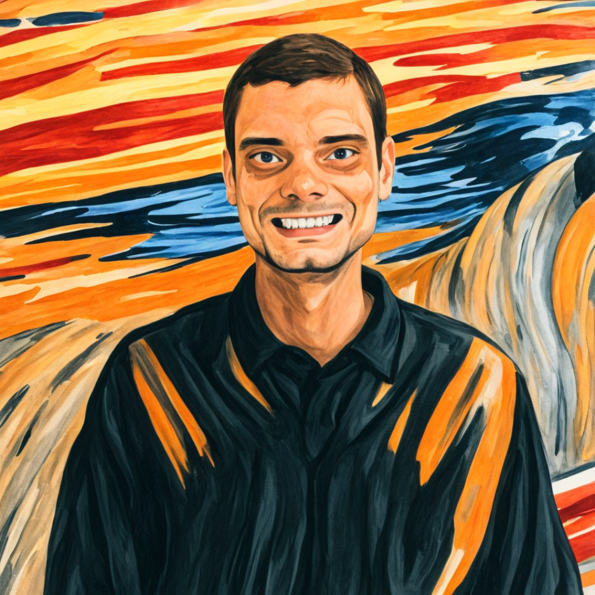
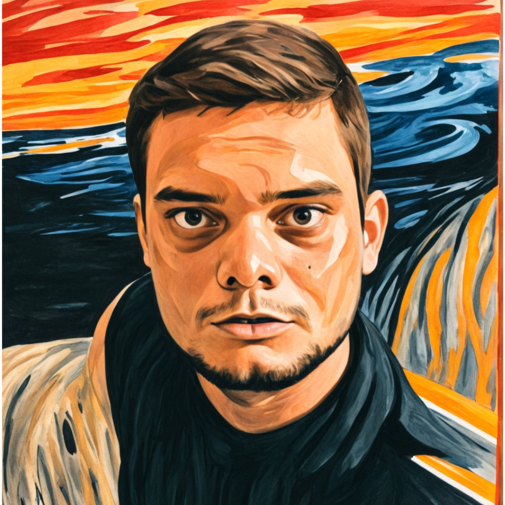

# Natural ou Fake Natty? Como Vencer na Era das IAs Generativas

## 🚀 Introdução

Modificação de imagens com base no tema "O Grito" do pintor Edvard Monch.

## O Grito da IA

### 📒 Descrição

Fotos antigas podem ser reanimadas e ganhar um novo contexto a partir da utilização de IA.

### 🤖 Tecnologias Utilizadas

Gerador de imagens do Canva

### 🧐 Processo de Criação

Fazer o upload do arquivo na ferramenta disponibilizada pelo Canva

### 🚀 Resultados

 

## Links Interessantes

[Base10: If You’re Not First, You’re Last: How AI Becomes Mission Critical](https://base10.vc/post/generative-ai-mission-critical/)

